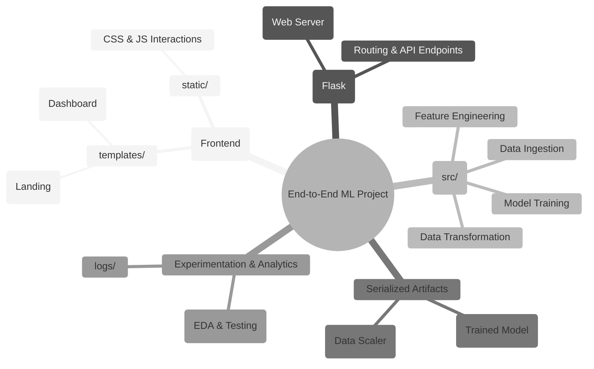

# END TO END ML PROJECT

  

Welcome to the **End-to-End ML Project**. This application is an advanced machine learning web pipeline engineered to forecast student mathematical performance using their behavioral and demographic data.

##  Project Architecture Mindmap

Below is a visual diagram detailing how all the components inside this repository connect and interact with each other to form a complete end-to-end pipeline:



##  Key Features

*   **Robust ML Pipeline**: Powered by highly tuned regression models including Gradient Boosting and CatBoost.
*   **Predictive Dashboard**: A premium, ultra-responsive UI capturing user inputs dynamically to feed the ML endpoints in real-time.
*   **7-Feature Demographic Analysis**: The model is trained on multiple key features (e.g., test preparation, parental education, lunch plan, reading & writing scores).
*   **Modular Architecture**: Built utilizing extensive object-oriented programming to keep data ingestion, data transformation, and model-training entirely decoupled inside the `src/` folder.

##  Technology Stack

*   **Core Logic**: Python, Flask
*   **Machine Learning**: Scikit-Learn, Pandas, NumPy, CatBoost
*   **Frontend**: HTML5, CSS3, JavaScript (ES6)
*   **Environment & Deployment**: Custom WSGI setup, AWS Elastic Beanstalk configuration ready (`.ebextensions`)

##  Installation & Usage Instructions

1. **Clone the repository:**
   ```bash
   git clone https://github.com/yourusername/end-to-end-ml.git
   cd end-to-end-ml
   ```

2. **Set up a Virtual Environment:**
   *Windows:*
   ```bash
   python -m venv venv
   .\venv\Scripts\activate
   ```
   *macOS/Linux:*
   ```bash
   python3 -m venv venv
   source venv/bin/activate
   ```

3. **Install required packages:**
   ```bash
   pip install -r requirements.txt
   ```

4. **Launch the web application:**
   ```bash
   python app.py
   ```
   
